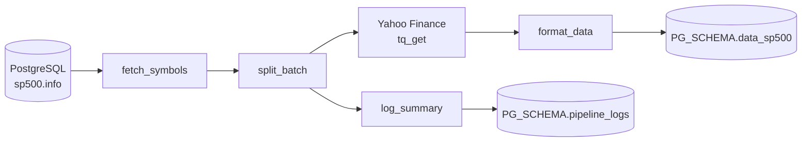

# pipelineR

<!-- badges: start -->

[](https://github.com/pkinif/pipelineR/actions/workflows/R-CMD-check.yaml)
<!-- badges: end -->

# 

**pipelineR** is an R package that automates fetching S&amp;P 500–style stock data from **Yahoo Finance**, reshaping it, and loading it into **PostgreSQL** with deduplication and batch logging.

## Features

- Secure PostgreSQL connection via environment variables (validated before connect)
- Symbol universe from `sp500.info` in the database
- Historical OHLCV via `tidyquant` (Yahoo Finance), with optional retry on API errors
- Wide → long pivot compatible with `data_sp500`
- Inserts only new `(index_ts, date, metric)` rows
- Batch summaries appended to `pipeline_logs`
- Tests with **testthat** (DB-dependent tests skip when tables or env are missing)

## Installation

```r
remotes::install_github("pkinif/pipelineR")
```

With vignette (requires building from source):

```r
remotes::install_github("pkinif/pipelineR", build_vignettes = TRUE)
# Then: vignette("getting-started", package = "pipelineR")
```

## Quick start

1. Set environment variables (e.g. in `~/.Renviron`):

| Variable       | Description                                      |
|----------------|--------------------------------------------------|
| `PG_DB`        | Database name                                    |
| `PG_HOST`      | Host                                             |
| `PG_USER`      | User                                             |
| `PG_PASSWORD`  | Password                                         |
| `PG_SCHEMA`    | Schema for `data_sp500` and `pipeline_logs`      |
| `user_login`   | Id written into `pipeline_logs`                  |

2. Run the pipeline:

```r
library(pipelineR)

start_pipeline(
  from = Sys.Date() - 10,
  to = Sys.Date(),
  batch_size = 20
)
```

For ad hoc maintenance (e.g. trimming recent rows before a re-run), see `dev/external_env.R` in the repository.

## Workflow



## Main functions

| Function | Description |
|:---------|:------------|
| `connect_db()` | Open PostgreSQL connection using `PG_*` env vars |
| `fetch_symbols()` | Distinct `symbol`, `index_ts` from `sp500.info` |
| `split_batch()` | Split symbol tibble into batches |
| `yahoo_query_data()` | Download OHLCV for a batch |
| `format_data()` | Pivot wide prices to long (`metric` / `value`) |
| `insert_new_data()` | Append new rows to `data_sp500` |
| `build_summary_table()` | Empty log tibble |
| `log_summary()` | Append one batch row to the log tibble |
| `push_summary_table()` | Write logs to `pipeline_logs` |
| `start_pipeline()` | End-to-end orchestration |

After `library(pipelineR)`, open any help page with `?start_pipeline`, `?connect_db`, etc.

## Database expectations

- **`sp500.info`**: at least `symbol`, `index_ts` (read by the pipeline).
- **`{PG_SCHEMA}.data_sp500`**: long table with `index_ts`, `date`, `metric`, `value` (and any other columns your DB expects for append).
- **`{PG_SCHEMA}.pipeline_logs`**: compatible with `push_summary_table()` (`user_login`, `batch_id`, `symbol`, `status`, `n_rows`, `message`, `timestamp`).

## Requirements

- **R** ≥ 4.1.0
- **Imports**: `DBI`, `RPostgres`, `dplyr`, `glue`, `lubridate`, `tibble`, `tidyr`, `tidyquant`
- **PostgreSQL** with the schema and tables above
- Network access for Yahoo Finance when running the pipeline

## Documentation

- Help: `library(pipelineR); ?pipelineR-package; ?start_pipeline`
- Vignette: *Getting started with pipelineR* (`vignette("getting-started")` if installed with vignettes)
- Source and issues: <https://github.com/pkinif/pipelineR>

## Troubleshooting (RStudio Check / vignettes)

### Error: `xfun` 0.52 loaded but `>= 0.55` required

Recent **knitr** needs a current **xfun**. The build step runs in a **new R process**, but if you still see this:

1. Update and **restart R** (RStudio: *Session → Restart R*), then try Check again:
   ```r
   install.packages(c("xfun", "knitr", "rmarkdown"), type = "binary")
   packageVersion("xfun")   # should be >= 0.55
   ```
2. Confirm RStudio uses the same R installation as the console: *Tools → Global Options → R*.
3. If another library path has an old **xfun**, inspect `find.package("xfun")` and `.libPaths()`.

### Warnings after `--no-build-vignettes`

If you pass **`--no-build-vignettes`** to `R CMD build` / `devtools::check`, the vignette **is not knitted**, so there is no output under **`inst/doc/`**. **R CMD check** then reports **WARNING** (e.g. “Package vignette without corresponding single PDF/HTML”). That is **expected** with that flag.

For a **clean check** (no such warnings), run **`devtools::check()`** or the RStudio **Check** button **without** `--no-build-vignettes` — with **xfun ≥ 0.55**, the vignette should build normally.

Optional **fast** iteration (accepts vignette-related warnings):

```r
devtools::check(document = FALSE, vignettes = FALSE)
```
